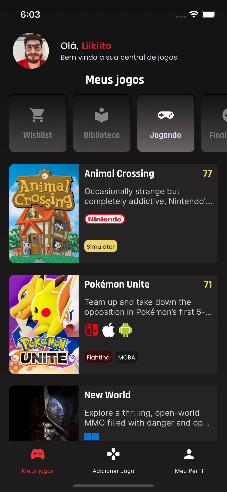
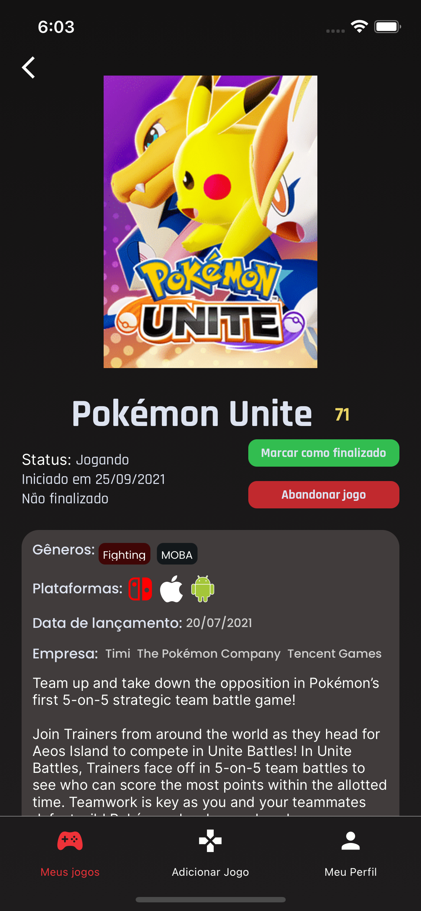
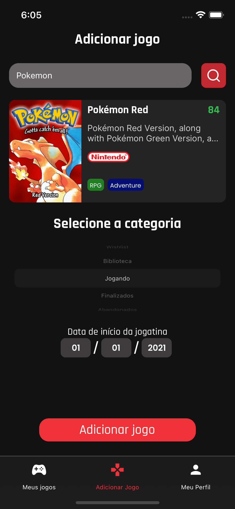
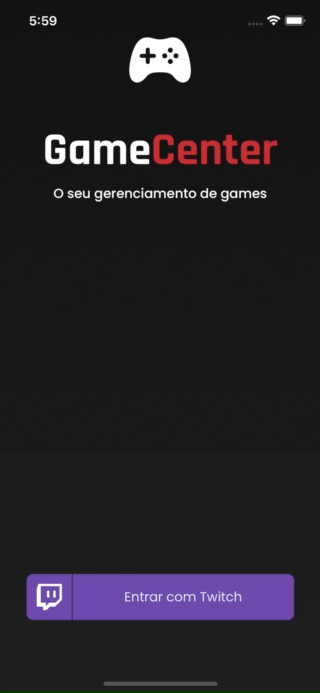
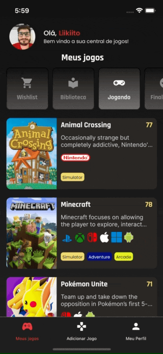
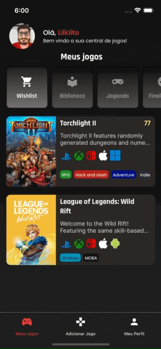
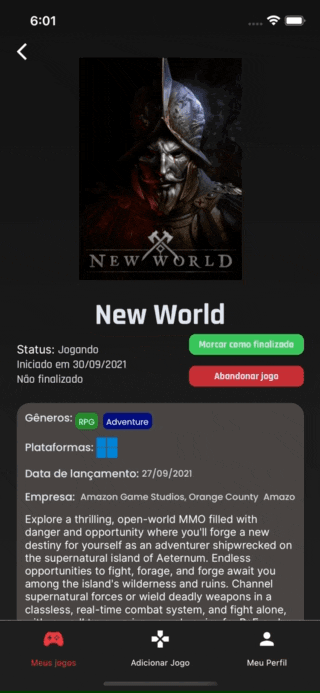

<div id="top"></div>


<!-- [![Contributors][contributors-shield]][contributors-url]
[![Stargazers][stars-shield]][stars-url]
[![Issues][issues-shield]][issues-url]
[![MIT License][license-shield]][license-url] -->


<!-- PROJECT LOGO -->
<br />
<div align="center">
  <a href="https://github.com/othneildrew/Best-README-Template">
    
  </a>

  <h3 align="center">Seus jogos no controle</h3>

  <p align="center">
  </p>
    <div>
    
    
    
  </div>
</div>


<!-- TABLE OF CONTENTS -->
  <h1><summary>Sumário</summary></h1>
  <ol>
    <li><a href="#sobre-o-projeto">Sobre o Projeto</a></li>
    <li><a href="#feito-com">Feito com</a></li>
    <li><a href="#começando">Começando</a></li>
    <li><a href="#pré-requisitos">Pré-Requisitos</a></li>
    <li><a href="#instalação">Instalação</a></li>
    <li><a href="#exemplos-de-uso">Exemplos de uso</a></li>
    <li><a href="#estrutura-de-arquivos">Estrutura de Arquivos</a></li>
    <li><a href="#contribuindo">Contribuindo</a></li>
    <li><a href="#licença">Licença</a></li>
    <li><a href="#contato">Contato</a></li>
    <li><a href="#ferramentas-adicionais">Ferramentas adicionais</a></li>
  </ol>


<!-- SOBRE O PROJETO -->
## 📝 Sobre o projeto

GameCenter é um App mobile (androind & iOS) e uma API que permite o gerenciamento de todos os seus jogos e todos os dados referentes a eles, para todas as plataformas. Você tem acesso aos jogos que está jogando, irá jogar e quais estão finalizados. O objetivo da aplicação é fornecer aos usuários uma forma simples de gerenciar todos os seus jogos em seu disposito móvel.

Foi desenvolvido na disciplina de Projeto Integrado, que é uma matéria para os alunos de Ciência da Computação na UFES - Universidade Federal do Espírito Santo, no Brasil.

Algumas coisas que você pode fazer:
* Login com sua conta da Twitch
* Buscar por jogos para adicionar à sua biblioteca
* Mudar o status dos jogos que você já tem
* Definir as datas de início e fim das jogatinas, te possibilitando visualizar quanto tempo demorou para finalizar

<p align="right">(<a href="#top">Voltar ao topo</a>)</p>


### 🔨 Feito com

Aqui estão algumas linguagens, frameworks, ferramentas e bibliotecas que usamos no desenvolvimento dessa aplicação:

* [Java](https://www.java.com/)
* [Spring Boot](https://spring.io/projects/spring-boot)
* [Maven](https://maven.apache.org/)
* [MongoDB Atlas](https://www.mongodb.com/cloud/atlas)
* [Typescript](https://www.typescriptlang.org/)
* [CSS](https://developer.mozilla.org/en-US/docs/Web/CSS)
* [React Native](https://reactnative.dev/)
* [Expo](https://expo.dev/)

<p align="right">(<a href="#top">Voltar ao topo</a>)</p>


<!-- GETTING STARTED -->
## ⌨️ Começando

Aqui estão algumas instruções sobre como configurar o projeto localmente. Para obter uma cópia local, siga os passos abaixo:

### Pré-requisitos

Todas as ferramentas que você precisa ter instalado para rodar o projeto e as suas versões
* nodejs - v16.9.1
* java - openjdk 16.0.2
* mvn - 3.8.3
* expo - 4.12.0

Nesse projeto usamos yarn, mas você pode utilizar npm caso prefira
* npm - 7.21.1
* yarn - 1.22.11


Se você pretende rodar esse projeto localmente, você precisa pesquisar como instalar todos essas ferramentas para o seu sistema operacional, e pode encontrar todas essas informações nos seus devidos sites oficiais. Além disso, se você quer testar a aplicação mobile, precisa configurar um simulador Android ou um simulador iOS, caso utilize MacOS. Você pode utilizar o Expo web para rodar uma versão web do app, mas não funciona com as bibliotecas que utilizamos.

## 💻 Instalação

Clone o repositório
```sh
git clone https://github.com/matheuslenke/GameCenter.git
```

### ⚙️ Inicializando Back-end
```bash
  # Entre na pasta backend
  $ cd backend
  # Instale as dependencias
  $ mvn install
  # Rode a aplicação
  $ mvn spring-boot:run
```

### 📱 Inicializando Front-end
```bash
  # Entre na pasta frontend
  $ cd frontend
  # Instale as dependencias:
  $ yarn
  # Para rodar a aplicação em modo de desenvolvimento:
  $ expo start
```

<p align="right">(<a href="#top">Voltar ao topo</a>)</p>


<!-- USAGE EXAMPLES -->
## 📲 Exemplos de uso

Aqui você consegue visualizar alguns gifs de como alguém utilizaria o aplicativo. Algumas das funcionalidades que o usuário possui:
* Logar-se com uma conta da Twitch.tv, e cada jogo que for adicionado será linkado automaticamente com essa conta 
* Visualizar todos os seus jogos por status, e aprender mais sobre os jogos nos detalhes do mesmo
* Adicionar novos jogos à sua biblioteca
* Modificar o status dos jogos já presentes na sua biblioteca
* Visualizar as informações coletadas da api da Twitch.tv e deslogar-se

<div align="center">
  
  
  
  
</div>


<p align="right">(<a href="#top">Voltar ao topo</a>)</p>

## 📁 Estrutura de arquivos

Aqui, temos uma breve explicação da estrutura de arquivos

```
Raiz do projeto
│   README.md
│   
└───backend
│   │    As classes java da aplicação se encontram aqui
│   └───src/main/java/br/ufes/gamecenter/apirest
│      └───ApirestApplication.java - Classe principal do Backend
│      └───config - Configurações de erro
│      └───controller - Aonde as requisições são mapeadas
│      └───model - Entidades da aplicação
│      └───repository - Interface que conecta com o banco de dados diretamente
│      └───service - Lógica entre repository e controller
│      └───security - Classes do Spring Security
│
└───frontend
│   │   index.js - Arquivo de entrada
│   │   App.tsx - Componente de entrada
|   |
│   └───src
│       │
│       └───assets - Imagens, SVGs, etc usados na aplicação
│       └───components - Componentes usados nas telas
|       └───config - Arquivos de configuração
│       └───global - Arquivos globais e de temas
|       └───hooks - Hooks customizados e Contexts
|       └───routes - Rotas da aplicação
|       └───screens - As telas da aplicação
|       └───services - Conexões com APIs e Axios
|       └───utils - Funções de utilidade
|
└───database
    │   #Deprecated, este arquivo não está corretamente configurado
    │    para se conectar com o backend
    └───docker-compose.yml

```


<!-- CONTRIBUTING -->
## 🤝 Contribuindo

Se você tem alguma sugestão que fará este app ficar melhor, por favor realize um fork e crie um Pull Request. Você pode também simplesmente abrir uma issue com a tag "enhancement" para sugestões e "error" para problemas enfrentados

1. Faça um fork do Projeto
2. Crie seu branch da Feature (`git checkout -b feature/AmazingFeature`)
3. Faça commit das suas modificações (`git commit -m 'Add some AmazingFeature'`)
4. Faça um push para o branc (`git push origin feature/AmazingFeature`)
5. Abra um Pull Request

<p align="right">(<a href="#top">Voltar ao topo</a>)</p>


<!-- LICENSE -->
## 🔐 Licença

Distribuído na Licença MIT. Veja `License.txt` para mais informações

<p align="right">(<a href="#top">Voltar ao topo</a>)</p>

<!-- CONTACT -->
## ✉️ Contato

Matheus Lenke Coutinho - matheus.l.coutinho@edu.ufes.br

Igor Wandermurem Dummer - igor.dummer@edu.ufes.br

Link do projeto: [https://github.com/matheuslenke/GameCenter](https://github.com/matheuslenke/GameCenter)

<p align="right">(<a href="#top">Voltar ao topo</a>)</p>


<!-- ACKNOWLEDGMENTS -->
## 🔧 Ferramentas adicionais

Ferramentas adicionais que recomendamos para desenvolvimento

* [Android Studio](https://developer.android.com/studio)
* [Visual Studio Code](https://code.visualstudio.com/)
* [Insomnia](https://insomnia.rest/)
* [IntelliJ IDEA](https://www.jetbrains.com/pt-br/idea/)

<p align="right">(<a href="#top">Voltar ao topo</a>)</p>

